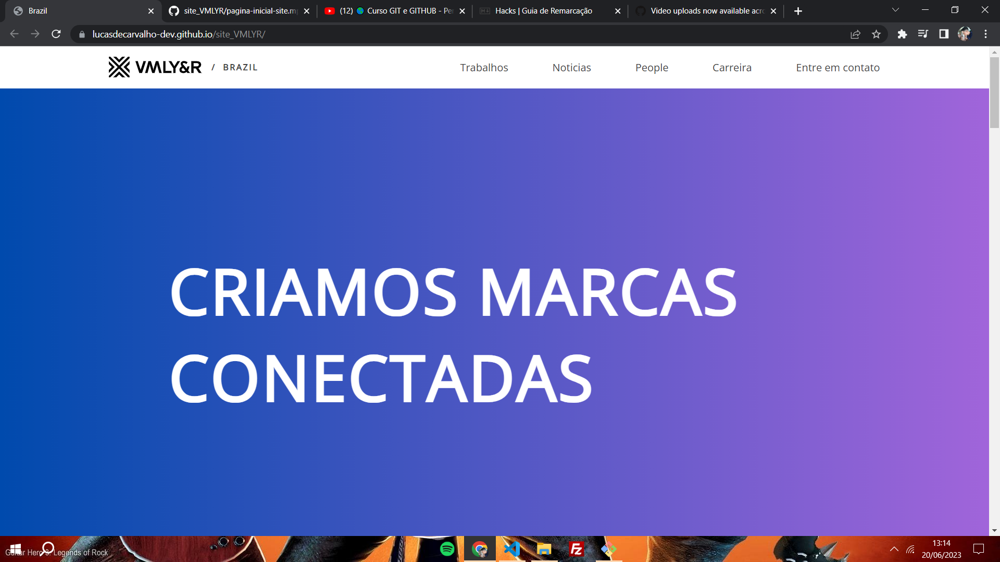

# Página Inicial - Site VMLYR

<https://lucasdecarvalho-dev.github.io/site_VMLYR/>

Página inicial baseada no site oficial da <a href="https://www.vmlyr.com/pt-br/brazil">VMLYR</a>. 

VMLYR é uma empresa de marketing e comunicação especializada em publicidade, mídia digital e social, promoção de vendas, marketing direto e consultoria de identidade de marca.

- HTML5, CSS3 e JavaScript
- Aplicação de conceitos 
  - HTML:
    - Semântica: ((`<header>`), (`<section>`), (`<footer>`))
    - Símbolos: (`&nbsp`)
  - CSS:
    - Grid (`display: grid`)
    - Responsividade com (`@media`)
    - Pseudo-classe (`:last-child`)
  - JavaScript:
    - Função: (`function(){}`)
    - Seletor: (`document.getElementById()`)
    - Método: (`element.setAttribute()`)

(obs: projeto atualizado frequentemente)